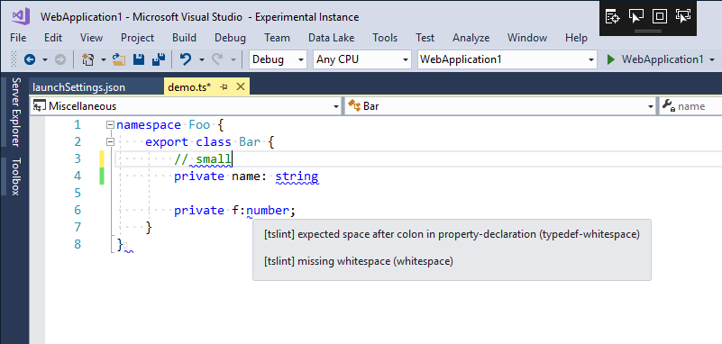

# What is it?

Visual Studio 2017 extension for liting **Typescript** files using `tslint`.

# What does it do?

At the moment, the extension if very limited. It is a result of up-to 8 hours of work, so don't expect much in these early stages.
It can only mark (underline) all issue it detects when opening or saving `.ts` file.

# How does it work?

When `.ts` is opened or saved, `tslint` is run in the background (if installed localy for the solution) and
code in the editor is marked (underlined) based on the `JSON` output from `tslint`.

# Further development

This extension is not perfect and more work is required. Some of the work that should be done:

- [ ] Make it work with local and global installations
- [x] Make is support both warnings and erros along with different markings in the editor
- [x] Make it support `Error List` in Visual Studio (basic support)
- [ ] Make it support automated fixes
- [ ] Performance optimizations
