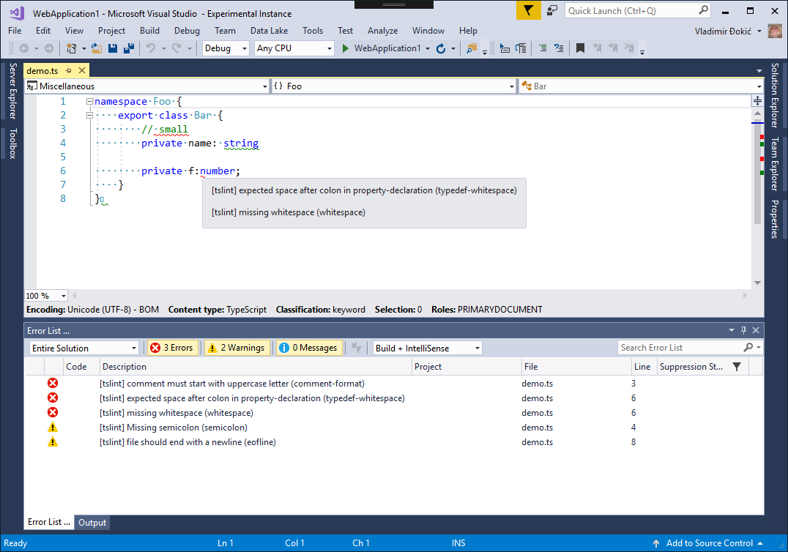

# What is it?

Visual Studio 2015/2017 extension for linting **Typescript** files using `tslint`.
You can download extension on the marketplace:

For Visual Studio 2015, go [here](https://marketplace.visualstudio.com/items?itemName=vladeck.TSLint2015).

For Visual Studio 2017, go [here](https://marketplace.visualstudio.com/items?itemName=vladeck.TSLint).

# How does it work?

When `.ts` is opened or saved, locally installed `tslint` is run in the background and
code in the editor is underlined (marked) based on the `tslint` findings. Hovering over the underline
gives additional info in the form of a tooltip and warnings and errors are listed in the **Error List**.

# Roadmap

- [x] Support both warnings and errors
- [x] Support the **Error List**
- [ ] Support automated fixes
- [ ] Optimizations
